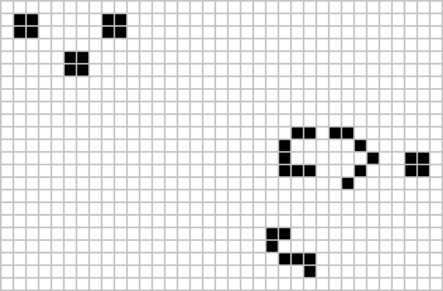

# Conway's Game of Life

> **Game of Life** is a world that consists of an infinite, two-dimensional square grid. 
> Each cell in the grid can be *alive* or *dead*. Every cell interacts with its eight 
> neighbours (i.e horizontally, vertically and diagonally adjacent cells). 

At each step the cells are updates according to the following set of rules:
1. Any live cell with fewer than two live neighbours dies (underpopulation).
2. Any live cell with two or three live neighbours lives on to the next generation.
3. Any live cell with more than three live neighbours dies (overpopulation).
4. Any dead cell with exactly three live neighbours becomes a live cell (reproduction).

To implement Game of Life in MATLAB, use a matrix to hold the 2-D grid. A cell is alive if its matrix element is 1 and dead if 0. 

You will need the following steps:
* Calculate how many live neighbours each cell has.
* Update the grid according to the rules above.
* Plot the grid in each generation.

## Instructions

> Objective: Implement the Conway's Game of Life by counting the neighbours of each grid cell and iterating over all the cells of a random sparse matrix.

1. As a group, write a well-commented m-file script (`solutions.m`) that implements the Conway's Game of Life by iterating over all the grid cells and for each counting the neighbours. 
2. You can either be careful not to access elements that are beyond the limits of the matrix, or make the matrix slightly larger and only iterate over the middle part of the matrix.
3. Generate a new random sparse matrix using as the initial pattern, so the solution will be unique everytime you run the script.
4. Display the grid using `pcolor` or `spy` for each generation.

## Tips

- This assignment makes use of sparse matrices especially for large grids. Some useful functions are `sparse` and `sprand`.
- Marks are awarded for clarity. Apart from the `solutions.m` script, you may turn in other format of your solutions (figures, animations, functions, etc.) 
- You are expected to write an elegant solution, not a brute force one. Try to figure out how to use a vectorized counting method and employ less `if-` 
	statements and `for-` loops.
- Bonus marks for exploring this topic further, and finding an alternative 
	dynamic with nice results. Other alternatives include
  * inputting an image as the initial pattern,
  * changing the birth/life/death rules or definition of neigbourhood,
  * using a non-square grid, such as triangular or hexagonal.

